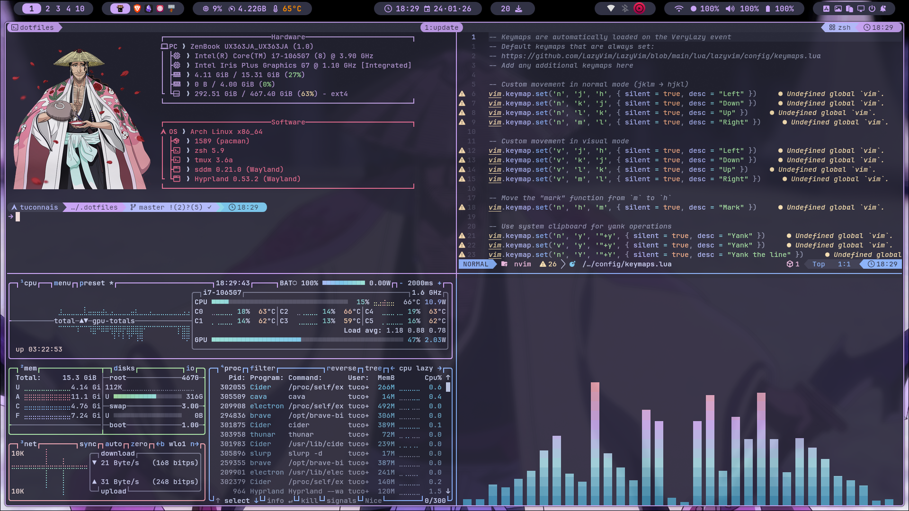
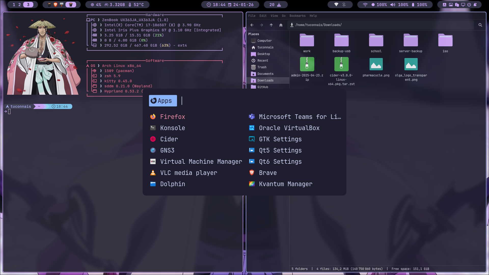

# 🧪 dotfiles

> ⚙️ My personal Arch Linux dotfiles – optimized for Hyprland + Wayland workflow.

This repository contains my full system configuration for Arch Linux using **Hyprland**, designed to be clean, minimal, and efficient.  
Everything is managed with [GNU Stow](https://www.gnu.org/software/stow/) for modularity and ease of maintenance.

---

## 🖼️ Screenshots

| Desktop | Tmux |
|:--|:--|
|  |  |
| Hyprlock | Rofi |
|  |  |

---

> [!WARNING]
> Desktop version of configuration isn't updated yet so if you are on a desktop PC wait for this warning to disappear before installing this configuration.

> [!NOTE]
> **Keyboard layout (AZERTY-FR)**
>
> These dotfiles are built for **AZERTY (FR)**.
> To stay consistent with the layout, all Vim-style movements (`h j k l`) are remapped to **`j k l m`** across the config (Neovim, tmux, Hyprland, fzf, etc.).
>
> If you are using a different keyboard layout (e.g. QWERTY), you will need to manually adjust or remove some configurations listed below.
>
> - **Hyprland** config (~/.config/hypr/hyprland.conf);
>   * Update the `kb_layout` option to match your keyboard layout.
> - **Hyprland keybindings** config (~/.config/hypr/keybindings.conf)
> - **Less** config (~/.lesskey);
> - **Nvim** config (~/.config/nvim/lua/config/keymaps.lua);
> - **snacks.nvim** config (~/.config/nvim/lua/plugins/snacks.lua)
> - **vim-tmux-navigator.nvim** config (~/.config/nvim/lua/plugins/vim-tmux-navigator.lua)
> - **Fzf** config (~/.zshrc);
>   * Update the following line to matchc your keyboard layout:
>     ```bash
>     export FZF_DEFAULT_OPTS="--bind=ctrl-k:down,ctrl-l:up"
>     ```
> - **Tmux** config (~/.config/tmux/tmux.conf);

---

## 🧰 What’s inside?

- 🌐 **Hyprland** (Wayland window manager)
- 💻 **Kitty**, **Zsh**, and **Starship**
- 📝 **Neovim** (Lua-based config)
- 🎨 GTK, Qt5/6, Kvantum theming (catppuccin mocha)
- 🧱 Waybar, Wlogout, Hyprlock, Hypridle, Hyprpaper
- 🛠️ CLI tools: bat, lazygit, scripts, etc.
- 📁 All configurations symlinked with GNU Stow

---

## ✅ Installation

This script is designed to work for a minimal [Arch Linux](https://wiki.archlinux.org/title/Arch_Linux) install and it may break your system. Use it at your own risk.

> [!CAUTION]
> The script modifies your `GRUB` and `SDDM` configurations to apply themes.

To install, run the following command:

```shell
sh -c "$(curl -fsSL https://raw.githubusercontent.com/tuconnaisyouknow/dotfiles/refs/heads/master/install.sh)"
```

> [!IMPORTANT]
> Please reboot after the install script completes.

---

## 🚧 Coming soon

- 📃 **Explanations** of each component

---

## 📎 Related

Looking for my Windows configuration (PowerShell, Windows Terminal, etc.)?  
➡️ Check out [dotfiles-windows](https://github.com/tuconnaisyouknow/dotfiles-windows)

---

## 📜 License

MIT — Feel free to explore, fork, and adapt.

---
