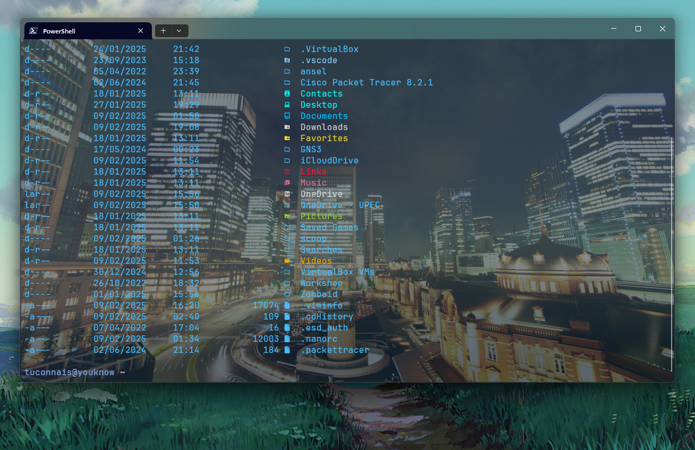

# 💀 tuconnaisyouknow's dotfiles

## ⚠️ Warning  

**Use at your own risk!**  
These configurations modify system settings and require **PowerShell 7**. Make sure you understand what each command does before executing it.

## ℹ️ About  

This repository contains my personal configurations for various tools and environments.  
It currently includes my **PowerShell configuration** to enhance terminal usability.

## 📂 Contents  

- ⚡ **PowerShell Configuration**
- 🛠️ **More coming soon...**

## ⚡ PowerShell Setup  

### 📌 Features  

- Custom **PowerShell prompt** with **Oh My Posh**  
- Pre-configured **PowerShell modules** for better productivity  
- **Retrowave theme** for Windows Terminal  
- Install scripts for essential CLI tools  

### 📌 Requirements  

Make sure you have the following installed:  

🔹 [Windows Terminal](https://apps.microsoft.com/detail/9n0dx20hk701?amp%3Bgl=fr&hl=fr-FR&gl=FR)  
🔹 [PowerShell 7.5.0](https://apps.microsoft.com/detail/9mz1snwt0n5d?hl=en-US&gl=US)  
🔹 [JetBrainsMono Nerd Font](https://www.nerdfonts.com/font-downloads)  

### 🎨 Terminal Theme Setup  

1️⃣ **Launch** Windows Terminal.  
2️⃣ **Go to** Windows Terminal settings and set **PowerShell** as the default terminal.  
3️⃣ **Open** the JSON configuration file *(bottom left corner in the settings menu)*.  
4️⃣ **Locate** the `"schemes"` section and **add** the contents of `retrowave.json` to it.  
5️⃣ **Go to** `Defaults Profile -> Appearance` and set `JetBrainsMono Nerd Font` as the `Font face`.  
6️⃣ **In** `Defaults Profile -> Appearance`, set `retrowave` as the `Color scheme`.  
7️⃣ **In** `Defaults Profile -> Appearance`, set `Cursor shape` to `Filled Box`.  

### ⚡ Install Dependencies  

1️⃣ **Download the repository** and open a terminal in its directory.  
2️⃣ **Run** the following commands:  

```powershell
# Install Scoop package manager
iwr -useb get.scoop.sh | iex

# Install utilities via Scoop
scoop install curl sudo jq vim gcc oh-my-posh fzf

# Install Git via Winget
winget install -e --id Git.Git

# Install PowerShell modules
Install-Module posh-git -Scope CurrentUser -Force
Install-Module -Name Terminal-Icons -Repository PSGallery -Force
Install-Module -Name PSReadLine -AllowPrerelease -Scope CurrentUser -Force -SkipPublisherCheck
Install-Module -Name PSFzf -Scope CurrentUser -Force

# Create configuration directory
New-Item -Path "$env:USERPROFILE\.config\powershell" -ItemType Directory -Force

# Copy custom configuration files
Copy-Item -Path ".\user_profile.ps1", ".\youknow.omp.json" -Destination "$env:USERPROFILE\.config\powershell"
```

### 🔧 Load the Custom PowerShell Profile  

To ensure your custom profile loads automatically:  

1️⃣ **Open** your PowerShell profile in Vim:  
```powershell
vim $PROFILE.CurrentUserCurrentHost
```

2️⃣ **Add** this line at the end and save:  
```powershell
. $env:USERPROFILE\.config\powershell\user_profile.ps1
```

3️⃣ **Restart** Windows Terminal for the changes to take effect.  

🎉 **Your setup is now complete! Enjoy your customized Windows Terminal experience!** 🚀🔥  

## 🤝 Contributing  

Feel free to fork and modify these configurations! If you have improvements, submit a pull request.  

## 📜 License  

This project is **MIT licensed**.