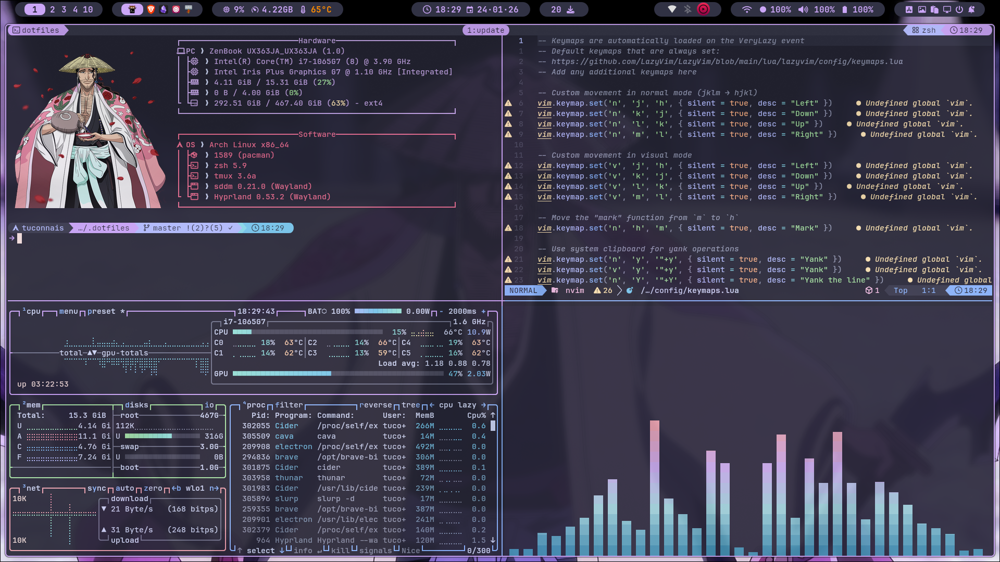
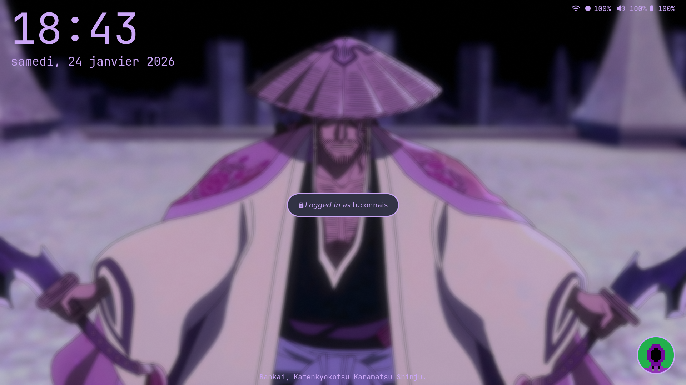
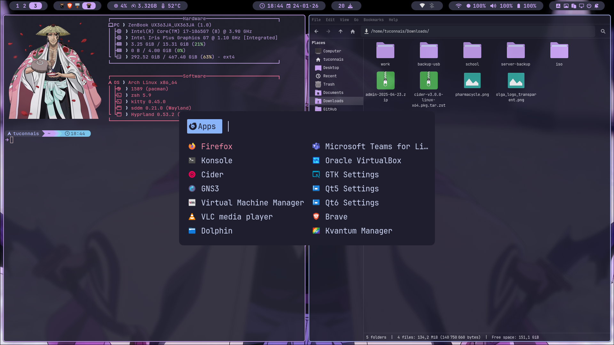

# 🌆 HyprPunk

> Arch Linux dotfiles for Hyprland, with a cyberpunk visual direction, Catppuccin Mocha colors, and Mauve accents.

HyprPunk is a complete personal Wayland setup built around **Hyprland**.  
It brings together the window manager, bars, menus, themes, scripts, terminal, shell, and CLI tools in a modular **GNU Stow** based configuration.

The goal is simple: a cohesive, dark, readable, and responsive desktop inspired by cyberpunk visuals without getting in the way of daily work.

---

## 🖼️ Screenshots

| Desktop | Tmux |
|:-:|:-:|
|  |  |
| Hyprlock | Rofi |
|  |  |
| SDDM | Thunar |
|  |  |
| Swaync | System Menu |
|  |  |
| Wallpaper Selector | SDDM Theme Selector |
|  |  |

---

## 🧰 What Is Included?

- 🪟 **Hyprland** as the main Wayland environment.
- 📊 **Waybar** with laptop and desktop variants.
- 🚀 **Rofi** menus for system actions, screenshots, clipboard history, wallpapers, SDDM themes, and Hyprland configuration.
- 🔒 **Hyprlock**, **Hypridle**, and **Hyprpaper** for lock screen, idle handling, and wallpapers.
- 🎬 **SDDM** with cyberpunk video themes.
- 💻 **Kitty**, **Zsh**, **Starship**, **Tmux**, and **Yazi** for the terminal workflow.
- 📝 **Neovim** with a Lua-based configuration.
- 🎨 **GTK 3/4**, **Qt5/Qt6**, and **Kvantum** themed around Catppuccin Mocha.
- 🛠️ **SwayNC**, **SwayOSD**, **Cliphist**, **Fastfetch**, **Btop**, **Cava**, **Bat**, and utility scripts.
> [!WARNING]
> There is currently an issue with how the SwayNC player buttons are rendered. I'm working on a fix.
- 📦 Modular configuration managed with GNU Stow.

---

## 🎨 Visual Identity

HyprPunk uses **Catppuccin Mocha** as its dark base and **Mauve** as the main accent color.

Core palette:

- 🌑 Base: `#1e1e2e`
- 🌘 Mantle: `#181825`
- 🌌 Crust: `#11111b`
- ✨ Text: `#cdd6f4`
- 💜 Mauve: `#cba6f7`
- 🪻 Lavender: `#b4befe`

The overall look favors soft contrast, mauve borders, dark surfaces, compact menus, and night-city inspired visuals.

---

## ✅ Installation

> [!CAUTION]
> The installer is designed for a fresh minimal Arch Linux installation.
>
> It may remove or replace existing user configurations, modify SDDM and GRUB, install system packages, and enable services. Read the script before running it on an existing desktop setup.

Run the installer:

```sh
sh -c "$(curl -fsSL https://raw.githubusercontent.com/tuconnaisyouknow/HyprPunk/refs/heads/master/install.sh)"
```

During installation, the script asks whether the machine is a **laptop** or a **desktop** and selects the matching modules:

- 📊 `waybar` or `waybar-desktop`
- 🔒 `hyprlock` or `hyprlock-desktop`

Reboot after the installation completes.

---

## 📁 Structure

```text
.
├── assets/screenshots/  # Images used by this README
├── avatars/             # User avatars
├── bat/                 # Bat configuration and Catppuccin theme
├── btop/                # Btop configuration and theme
├── cava/                # Audio visualizer configuration, shaders, and themes
├── fastfetch/           # Fastfetch system summary configuration and logo
├── fontconfig/          # JetBrainsMono Nerd Font preference
├── grub/                # CyberEXS GRUB theme installed system-wide
├── gtk3/                # GTK 3 theme settings
├── gtk4/                # GTK 4 theme settings
├── hypridle/            # Idle and suspend behavior
├── hyprland/            # Hyprland Lua config, keybindings, and monitors
├── hyprlock/            # Laptop lock screen
├── hyprlock-desktop/    # Desktop lock screen
├── hyprpaper/           # Wallpaper daemon configuration
├── kdeglobals/          # Minimal KDE integration for icons and Qt6ct
├── keyboard/            # Layout-specific application keymaps
├── kitty/               # Kitty terminal configuration
├── kvantum/             # Kvantum Catppuccin Mocha Mauve theme
├── nvim/                # Neovim Lua configuration
├── qt5/                 # Source palette for generated Qt5ct configuration
├── qt6/                 # Source palette for generated Qt6ct configuration
├── rofi/                # Shared Rofi configuration and menu themes
├── scripts/             # System, Rofi, display, Qt, and lock-screen helpers
├── sddm/themes/         # Cyberpunk video themes installed system-wide
├── starship/            # Starship prompt configuration
├── swaync/              # Notification center configuration
├── tmux/                # Tmux configuration
├── wallpapers/          # Cyberpunk wallpapers
├── waybar/              # Laptop Waybar configuration
├── waybar-desktop/      # Desktop Waybar configuration
├── yazi/                # Yazi file manager configuration and theme
└── zsh/                 # Shell, aliases, bindings, and functions
```

Most top-level configuration directories are GNU Stow modules that symlink into `$HOME`. `assets/`, `grub/`, and `sddm/` are repository or system-wide resources handled separately by the installer. The `qt5/` and `qt6/` directories only store the versioned Catppuccin palettes: the installer generates complete local Qtct configurations so graphical changes do not modify the repository.

---

## ⌨️ Keyboard Layout

> [!NOTE]
> These dotfiles support **AZERTY FR** and **QWERTY US** keyboard layouts.

The installer offers two keyboard profiles:

- `FR` — AZERTY layout with Vim-style movements remapped from `h j k l` to `j k l m`.
- `US` — QWERTY layout with the standard `h j k l` Vim-style movements.

`US` is the default when no profile has been selected yet or when the installer prompt is left empty.

The active profile can be changed later from **Rofi → Configuration → Keyboard**.

```bash
~/Scripts/keyboard-layoutctl.sh set us
~/Scripts/keyboard-layoutctl.sh set fr
```

The selection is stored in `$XDG_STATE_HOME/hyprpunk/keyboard-layout` (or `~/.local/state/hyprpunk/keyboard-layout`).
Hyprland, Kitty, tmux, and Rofi pick up the change immediately. New Zsh and Yazi processes use it on startup;
an existing Neovim instance can reload its movement mappings with `:KeyboardLayoutReload` (restart Neovim to
also rebuild plugin-specific mappings such as Snacks Explorer).

The layout integration covers:

- 🪟 `hyprland/.config/hypr/hyprland.lua`
- ⌨️ `hyprland/.config/hypr/keybindings.lua`
- 📖 `scripts/Scripts/keyboard-layoutctl.sh` (generated less bindings)
- 📝 `nvim/.config/nvim/lua/config/keymaps.lua`
- 💻 `tmux/.config/tmux/tmux.conf`
- 📁 `keyboard/yazi/fr.toml`
- 🚀 `rofi/.config/rofi/config.rasi`
- ⌨️ `kitty/.config/kitty/kitty.conf`
- 🐚 `zsh/.bindingrc` and `zsh/.zshrc`

Hyprland reads the selected XKB layout dynamically instead of hard-coding:

```lua
kb_layout = keyboard.xkb
```

---

## 🚀 Rofi Scripts

The main menu opens with `Ctrl + Alt + Space` and groups the available tools as follows:

- 🚀 **Apps** — launch desktop applications with `drun`.
- ▶️ **Action** — take or annotate screenshots, configure monitors, and toggle the touchpad.
- ⌨️ **Keybindings** — display the active, documented Hyprland bindings reported by `hyprctl`.
- 📋 **Clipboard** — browse the Cliphist history and copy an entry back to the Wayland clipboard.
- 🎨 **Style** — choose a wallpaper or apply an SDDM theme from visual previews.
- ⚙️ **Configuration** — open the Hyprland, Hyprlock, Hyprpaper, Hypridle, Neovim, Starship, and Kitty configuration files in Neovim.
- ⏻ **System** — lock, log out, reboot, or shut down the session.

The monitor menu supports per-output resolution, refresh rate, scale, relative positioning, persistent output numbering, and workspace assignment. It can also build an automatic layout or reset all saved display settings. Changes are applied through `~/Scripts/displayctl.sh` and persisted in `$XDG_STATE_HOME/hyprpunk/monitor-state.conf` (or `~/.local/state/hyprpunk/monitor-state.conf`).

Frequently used menus also have direct shortcuts:

- `Ctrl + ù` — clipboard history
- `Super + Ctrl + W` — wallpaper selector
- `Super + Ctrl + K` — keybinding viewer

Scripts are located in:

```text
scripts/Scripts/Rofi/
```

The top-level menu scripts accept a `standalone` mode for direct shortcuts and a `menu` mode that returns to their parent menu when cancelled. Rofi themes live in `rofi/.config/rofi/`; SDDM preview images live in `scripts/Scripts/Rofi/preview/`.

---

## ⚙️ System Services And Components

The installer enables or configures:

- 🌐 `NetworkManager`
- 🎬 `sddm`
- 🔊 `swayosd-libinput-backend.service`
- 🧱 `xwayland-satellite.service`
- 🔑 `gnome-keyring`
- 🎨 GTK, Qt, and Kvantum themes
- 📁 Papirus Dark icons with Catppuccin Mocha Mauve folders
- 🕹️ CyberEXS GRUB theme when GRUB is present

---

## 🔧 Customization

The main files to adapt to your machine are:

- ⌨️ `hyprland/.config/hypr/keybindings.lua` for keybindings.
- 🪟 `hyprland/.config/hypr/hyprland.lua` for window rules and workspaces.
- 🖼️ `wallpapers/Pictures/Wallpapers/` for wallpapers.

---

## 🚧 Roadmap

- ⌨️ Document the main keybindings.
- 📦 Add a dependency table per module.
- 🩺 Add troubleshooting notes for SDDM, Waybar, Rofi, and Hyprland.
- 🌆 Update the installer to use the `HyprPunk` name everywhere.
- ♻️ Add uninstall or backup restore instructions.

---

## 🙏 Credits

- 🕹️ The CyberEXS GRUB theme comes from [HenriqueLopes42/themeGrub.CyberEXS](https://github.com/HenriqueLopes42/themeGrub.CyberEXS).
- 🎬 The SDDM themes are inspired by [Darkkal44/qylock](https://github.com/Darkkal44/qylock).

---

## 📎 Related

Looking for my Windows configuration?

[dotfiles-windows](https://github.com/tuconnaisyouknow/dotfiles-windows)

---

## 📜 License

MIT. Feel free to explore, fork, and adapt.
